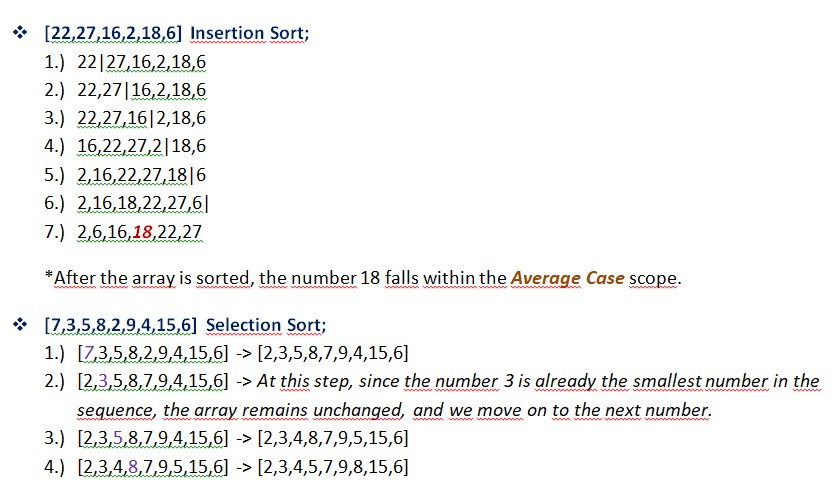
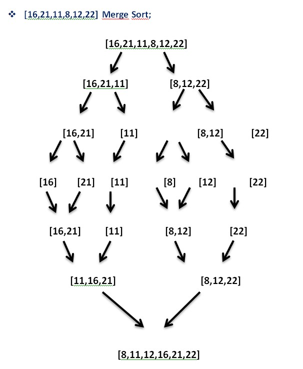
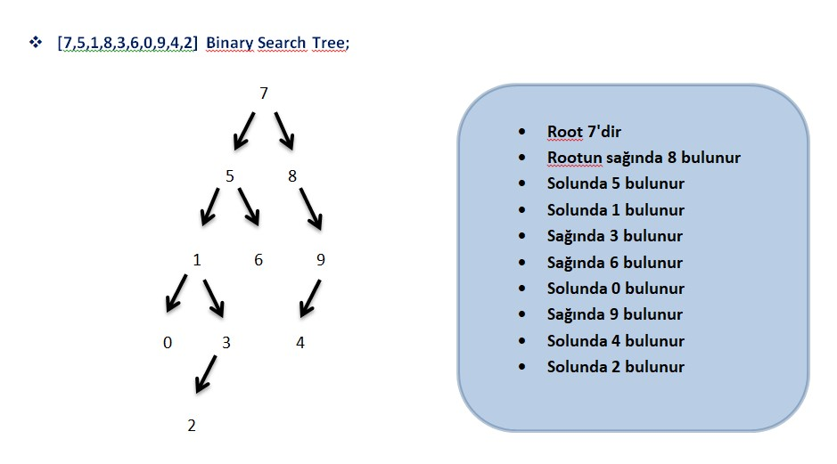

# Sorting Algorithms

## Insertion Sort-Selection Sort-Merge Sort-Binary Search Tree

 I'm explaining how an example is done for Insertion Sort, Selection Sort and Binary Search Tree.

## Insertion Sort

This algorithm iterates through each element, inserting each element into its appropriate position as it traverses the array. During the process, when inserting an element into the sorted part of the array, it is compared with the preceding elements and placed into the correct position.

Insertion Sort has a worst-case time complexity of 
𝑂(𝑛^2)
𝑂(n^2), but it can perform well on small datasets. The step-by-step process of the algorithm can be summarized as follows:

1.)Assuming the first element in the array is already sorted, we start with the second element in the array.

2.)Compare the second element with the first element and check if the second element is smaller, then swap them.

3.)Continue this process by comparing each element with the preceding ones and inserting it into the correct position by swapping as necessary.

4.)Repeat this process until the entire array is sorted."

## Selection Sort
This algorithm sorts the given array by comparing individual elements from smallest to largest or from largest to smallest, and by swapping them into their appropriate positions. 

The time complexity of this algorithm is O(n^2), meaning its performance significantly decreases as the size of the array increases. The step-by-step process of Selection Sort is as follows:

1.)Start from the beginning of the array, and at each step, find the smallest or largest element in the remaining part of the array.

2.)Place the found smallest or largest element at the end of the sorted portion of the array, or place the largest element at the beginning of the sorted portion.

3.)Repeat the process until all elements are sorted, iterating through the entire array.

## Merge Sort
The algorithm adopts the 'divide and conquer' approach. It divides an array into two halves, sorts each half separately, and then merges the sorted halves to form the resulting array. The main advantage of Merge Sort is that it always has a time complexity of O(n log n), meaning it shows efficient performance depending on the size of the array to be sorted. The main steps of Merge Sort are as follows:

1.) Divide: We split the array to be sorted into two halves, typically by considering the middle element of the array.

2.) Conquer: We recursively sort each of the two halves (left and right).

3.) Merge: We merge the sorted halves to form the resulting array. In this step, we compare elements from both halves, take the smaller one, and merge them. When one half runs out of elements, we directly add the remaining elements of the other half to the resulting array.

The main advantage of Merge Sort is that it always has a time complexity of O(n log n), meaning it shows efficient performance depending on the size of the array to be sorted.

## Binary Search Tree
Binary Search Tree (BST) is a tree data structure where each node has at most two children. In a BST, each node carries a key value smaller than all the nodes in its left subtree and larger than all the nodes in its right subtree. This property makes BST effective for search, insertion, and deletion operations.
The fundamental features of BST are as follows:

1.) Sorting: In BST, nodes can be sorted by traversing them in inorder (left-root-right) traversal since for any node, all nodes in its left subtree are smaller and all nodes in its right subtree are larger.

2.) Insertion and Deletion: When adding a new node or deleting a node, BST rearranges nodes in a sorted manner to maintain the structure of the tree. This makes insertion and deletion fast and efficient.

3.) Search: BST can quickly find a searched item by eliminating half of the tree at each step. This provides an average-case search time complexity of O(log n)

## Example

## Example 2

## Example 3

